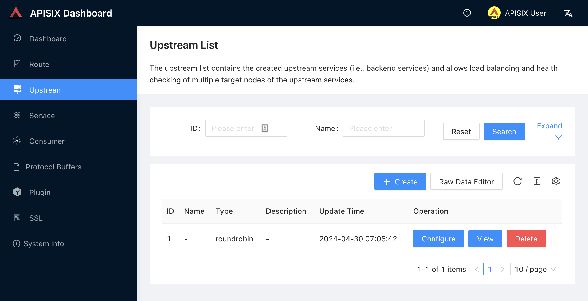
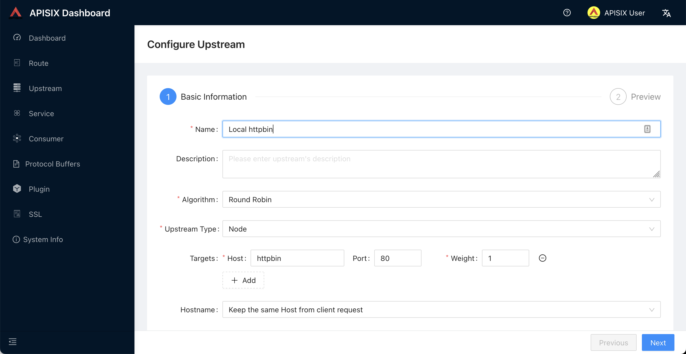
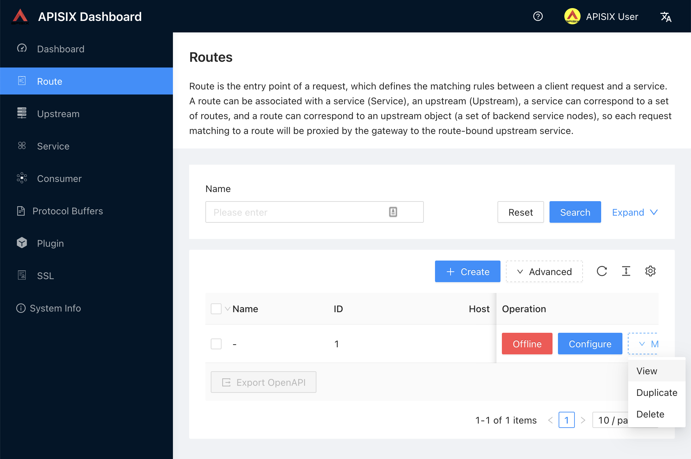

= Apache APISIX Hands-on Lab
Nicolas Fränkel
:source-highlighter: highlight.js
:toc: macro
:icons: font
:experimental: true
:sectnums:
:imagesdir: ./pages
:commandsdir: ./commands
:stylesheet: ./pages/styles.css

ifndef::env-github[]
++++

++++
endif::[]

Welcome to this workshop on https://apisix.apache.org/[Apache APISIX^]!
We will show here a couple of APISIX's nifty features that can help your information system cope with the challenges introduced by APIs:

* Routing your calls to an `Upstream`
* Available abstractions: `Route`, `Upstream`, `Consumer`, and `Plugin`
* The Apache APISIX dashboard
* Configuring APISIX with the dashboard
* Configuring APISIX with the command-line
* Monitoring APISIX
* Introduction to plugin development in Lua

The workshop is designed to be self-driven, but if at any point, you need help, just ask the instructor.

toc::[]

[NOTE]
====
The workshop was initially designed by Bobur Umurzukov with my help.
Thanks for all his hard work!
====

[discrete]
== Overview

[.right]

This section explains the context of the workshop.
If you prefer, you can directly skip to the link:#prerequisites[hands-on part].

https://apisix.apache.org/[Apache APISIX^] is an _API Gateway_ steered by the https://apache.org/[Apache Foundation^].

When you expose your services to the outside world, a lot of bad things can happen.
For instance, a malicious actor could try to access your services without permission.
Or they could try to access your services with invalid data.
Or they could try to overload your services with too many requests.

You need to protect your services.
However, it doesn't make any sense to let each developer team handle these requirements on each service.
The age-old solution is to hide your services behind a _reverse proxy_:
the reverse proxy is the single point of entry to your information system and protects your services.
https://www.nginx.com/[nginx^] is a solid and mature reverse-proxy.

Because they were designed before APIs, reverse proxies have a big issue:
they don't differentiate between clients.
For example, to protect agains +++<abbr title="Distributed Denial of Service">DDoS</abbr>+++ attacks, they can limit the number of requests for all clients.
Some may even allow to configure different limits for different IP addresses (or ranges).
However, API providers probably offer different quotas at different prices.
A single customer may want to subscribe to two different offers, for two different departments with different requirements - and different budgets.

That's where API Gateways enter the field.
An API Gateway is a reverse proxy "on steroids".
It should do everything a reverse proxy does, and more, especially in the context of APIs.

== Preparing for the workshop

* This workshops is largely based on https://docs.docker.com/compose/[Docker Compose^] v3.
You need a way to run https://www.docker.com/[Docker^] and Docker Compose files.
Docker Dashboard works.
If you want to use something else, please feel free to do so but if something doesn't work because of it, know that it decreases your chances that the instructor can help you with it.
* We use the https://curl.se/docs/manpage.html[curl^] command for API testing.
You can also use other tools, such as https://www.postman.com/[Postman^] or similar.

The workshop is hosted on a https://github.com/nfrankel/apisix-workshop/[GitHub repository^].
At the root of the repository is a `docker-compose.yml` file that defines the infrastructure.

Clone the repository:

[source,bash]
----
git clone https://github.com/nfrankel/apisix-workshop.git
----

Switch the current directory to the `apisix-workshop` path.

[source,bash]
----
cd apisix-workshop
----

Run the `docker compose` command to start the infrastructure:

[source,bash]
----
docker compose up
----

Once everything is started, we can run a simple `curl` command to check if APISIX is running.

[source,bash]
----
curl http://localhost:9180/apisix/admin/routes
----

Don't worry about the command for now.
It should return something similar to:

[source,json]
----
{"list":[],"total":0}
----

[IMPORTANT]
.Keep APISIX secure!
====
The Admin API, _e.g._, the command to list all routes, is normally secured by an API key.
In the context of this workshop, this security feature has been disabled to avoid extra typing.
*You should never ever use this setting in a production environement!*
Moreover, you should change the default API key before your first deployment.

[source,yaml]
----
deployment:
  admin:
    admin_key_required: true            <1>
    admin_key:
      - name: admin
        key: 5om3v3ryl0ng53cr3t         <2>
        role: admin
----

<1> The default value is `true`.
Keep it that way.
<2> Change the keyword to something more secure and keep it secret
====

== First steps

In this section, we will create the most basic object in APISIX, the `Route`.
When Apache APISIX receives a request matching the `Route` parameters, it forwards it to the configured service.

=== Dynamic configuration vs. static configuration

[NOTE]
====
In the context of APISIX, configuration can mean two things:
configuration of APISIX itself or configuration of its routing rules.
The workshop has taken care of the former, so you can learn about the latter.
====

Apache APISIX offers two configuration models.
By default, it uses a dynamic one:
to configure routing rules, you send HTTP requests to the _Admin API_.
Another option is to use static configuration based on a YAML file.
It's the way for GitOps-based organizations.

In this workshop, we will focus on dynamic configuration, _i.e._, HTTP calls.

=== Our first `Route`

In this section, we will create our first `Route`.
The Docker Compose file defines an `httpbin` service so you don't need Internet access.
The goal is to create a `Route` that forwards requests to the `httpbin` service, in particular:

[source,bash]
----
curl localhost:9080/anything
----

Read the https://apisix.apache.org/docs/apisix/getting-started/configure-routes/[documentation^] and create the `Route` for the above requirement.

If you cannot proceed further or when you are finished, reveal the hint:

.See the solution
[%collapsible]
====
[source,bash]
----
include::{commandsdir}/1_create_route.sh[]
----

<1> The `/apisix/admin/routes` endpoint manages `Route` objects.
<2> Because configuration is a highly critical feature, we need to authenticate via an API key.
Here, we use the default one.
It's highly advised to generate your own, and regularly change it.
<3> APISIX can match on several parameters:
host, HTTP method(s), path, and client IP addresses.
Only the path is required.
If methods are not specified, it matches all methods.
<4> Notice the star character:
every URI starting with `/anything/` matches the `Route`.
<5> `Upstream` defined embedded in the `Route`.
An `Upstream` references a cluster of nodes, which you can load balance across, depending on an algorithm.
The default algorithm is _round robbin_.
Here, we have a single `Upstream`.
====

At this point, we can check whether the configuration works:

[source,bash]
----
curl http://localhost:9080/anything
----

Astute readers might have noticed that the Admin API runs on port `9180` while the Gateway operates on port `9080`.
It allows to expose the latter to the outside world while keeping the former private for security reasons.

=== Create an `Upstream`

In the previous section, we created a `Route` with an embedded `Upstream`.
The problem with this approach is that you need to define the same `Upstream` in all the `Route` objects that use it.
APISIX offers a better way to manage this: the `Upstream` object.
We can create an `Upstream` once and reference it throughout multiple `Route` objects.

The Apache APISIX API is consistent:
the API for `Upstream` is similar to the API for `Route`.
With the help of the https://apisix.apache.org/docs/apisix/admin-api/#upstream-api[documentation^] and the command used to create the Route above, create an `Upstream` with the following properties:

* ID: `1`
* Single node
* The node points to `httpbin:80`

.See the solution
[%collapsible]
====
[source,bash]
----
include::{commandsdir}/2_create_upstream.sh[]
----
====

You can configure the `Upstream` with additional properties like health check, retries, retry timeout or load-balancing to multiple systems.

=== Bind the `Route` to the `Upstream`

In the previous section, we created an `Upstream` that referenced our backend service.
It can be referenced by `upstream_id` in a `Route`.
Create a new `Route` that references it with the help of the https://apisix.apache.org/docs/apisix/admin-api/#route-api[documentation^].

.See the command
[%collapsible]
====
[source,bash]
----
include::{commandsdir}/3_bind_route_to_upstream.sh[]
----

<1> We use the same id `1` as above, so we are replacing the previous `Route` with this one
<2> Match the `/anything*` path as before
<3> Forwards to the `Upstream` defined above
====

Let's test:

[source,bash]
----
curl localhost:9080/anything/goes
----

It should return the expected data from the configured `Upstream`.

`Upstream` objects are a powerful abstraction in Apache APISIX.
They allow to define a single object across multiple `Route` objects so that there is only a single `Upstream` that needs to be maintained.

== The APISIX Dashboard

Along with the Admin API, Apache APISIX offers a Dashboard.
The https://github.com/apache/apisix-dashboard[Apache APISIX Dashboard^] is designed to make it as easy as possible for users to configure Apache APISIX via a +++<abbr title="Graphical User Interface">GUI</abbr>+++.
You can find more information about the APISIX Dashboard in the https://apisix.apache.org/docs/dashboard/USER_GUIDE[user guide^].

If you have time, the Getting started with Apache APISIX Dashboard video tutorial is a good introduction to the dashboard:

video::-9-HZKK2ccI[youtube,width=840,height=470]

[IMPORTANT]
====
The dashboard execute HTTP API calls under the cover.
You can verify this claim by interacting with the dashboard with your favorite's browser tools enabled.
Hence, whatever we do with the dashboard, we can do with the Admin API.

The reverse is not true:
the dashboard doesn't cover every possible API call.
====

Remember that though the backend service could implement it, it's more efficient to factor this feature in the API Gateway than to implement it in every service.
For this reason, we are going to add authentication to the Route.

=== Display the existing objects

So far, we created a `Route` and an `Upstream` via the +++<abbr title="Command-Line Interface">CLI </abbr>+++.
We can see the result of our work on the dashboard.
It's accessible at <http://localhost:9000/>.
The credentials are `admin`/`admin` by default.

.APISIX Dashboard login
image::dashboard-login.png[APISIX Dashboard login,437,579]

After logging, go to btn:[Route] in the navigation bar on the left side.
In the `Route` list, we can see the `Route` we created previously.

.Routes List on the APISIX Dashboard
image::dashboard-routes-list.png[Routes List on the APISIX Dashboard]

Next, navigate to btn:[Upstream].
Likewise, the dashboard displays our `Upstream`.

.Upstreams List on the APISIX Dashboard

=== Update existing objects

The Dashboard allows not only viewing existing objects but also creating, updating and deleting object.
At the moment, neither the `Route` nor the `Upstream` have a user-friendly name.
We will use two different methods to add one:
via the _Configure_ wizard and directly via the JSON object.

==== Updating via the Configure wizard

. Go to the `Upstream` screen
. Click the btn:[Configure] button for the single `Upstream` displayed
. In the opening screen, set a name, _e.g._, "Local httpbin"
+
.Upstream details on the APISIX Dashboard

. Click btn:[Next], then btn:[Submit].
The list now displays the `Upstream` with its updated name.
+
.Updated Upstream list on the APISIX Dashboard
image::dashboard-upstreams-list-updated.png[Updated Upstream list on the APISIX Dashboard]

==== Updating via JSON

As an alternative to the wizard, we can directly update an object's JSON configuration.

. Navigate to the `Route` screen
. On the right side of the `Route` object, locate the menu:More[View] button
+
.Routes List on the APISIX Dashboard

. On the opening screen, change the name to something more descriptive, _e.g_, "Anything"
+
.Route Raw Configuration Editor on the APISIX Dashboard
image::dashboard-route-details-raw.png[Route Raw Configuration Editor,700,332]
. In the list, we can now see the updated `Route` name
+
.Updated Routes list on the APISIX Dashboard
image::dashboard-routes-list-updated.png[Updated Routes list on the APISIX Dashboard]

This is but a taste of the Apache APISIX Dasboard.
We continue the workshop with the CLI.

== Authenticating client requests

The `Route` we have created above is public.
Thus, anyone can access the underlying `Upstream` as long as they know the endpoint Apache APISIX exposes to the outside world.
It's not safe, as a malicious actor could use this endpoint.
In this section, we are going to set up authentication for requests to our local `httpbin` `Upstream`.

=== Create a `Consumer`

Authentication is tied to an _identity_; Apache APISIX represents an identity as a `Consumer` object.
With the help of the https://apisix.apache.org/docs/apisix/admin-api/#consumer[Admin API^], list all existing `Consumer` objects; there should be none.

.See the command
[%collapsible]
====
[source,bash]
----
include::{commandsdir}/4_list_consumers.sh[]
----
====

Now, let's create a `Consumer` object with the name `johndoe`.

.See the command
[%collapsible]
====
[source,bash]
----
include::{commandsdir}/5_create_consumer.sh[]
----
====

Now, list the `Consumer` objects again.
The result should be something like this (formatted for ease of reading):

[source,json]
----
{
  "list": [
    {
      "key": "/apisix/consumers/johndoe",
      "value": {
        "update_time": 1714465186,
        "create_time": 1714461458,
        "username": "johndoe"
      },
      "modifiedIndex": 58,
      "createdIndex": 38
    }
  ],
  "total": 1
}
----

=== Add a `Plugin` to a `Route` object

So far, we have used several APISIX abstractions: `Route`, `Upstream`, and `Consumer`.
We need one more to go further.
Apache APISIX builds upon a plugin-based architecture:
every functionality such as rate limiting, authentication, etc. is implemented via a `Plugin` object.
APISIX comes with a large set of https://apisix.apache.org/plugins/[built-in plugins^] for common capabilities, but you can create your own in case you can't find one that fits your requirements.

https://apisix.apache.org/plugins/#Authentication[A couple of existing plugins^] implement authentication.
To keep things simple, we are going to use the simplest one, the https://apisix.apache.org/docs/apisix/plugins/key-auth/[key-auth^] plugin.
With this plugin, we can authenticate requests based on either an HTTP header or a query parameter.
First, we need to add the `Plugin` to the `Route`.
Use the Admin API to enable the `key-auth` plugin for the `Route` we created earlier.

.See the command
[%collapsible]
====
[source,bash]
----
include::{commandsdir}/6_add_authentication_to_route.sh[]
----

<1> Use the `/routes` endpoints
<2> Work on the `Route` with ID `1`
<3> Patch the exising `Route`
<4> Set the `key-auth` plugin with no additional configuration
====

At this point, we control who can access the `/anything` endpoint by authenticating requests.
Requests that don't include a valid API key are rejected with an HTTP `401` status.
Let's check:

[source,bash]
----
curl -i localhost:9080/anything
----

Because we didn't set the authentication key, Apache APISIX will return a `401 Unauthorized` error.

[source,http]
----
HTTP/1.1 401 Unauthorized
Date: Tue, 30 Apr 2024 08:38:38 GMT
Content-Type: text/plain; charset=utf-8
Transfer-Encoding: chunked
Connection: keep-alive
Server: APISIX/3.9.0

{"message":"Missing API key found in request"}
----

To authenticate, we need to set the key on the `Consumer` object.
With the help of the https://apisix.apache.org/docs/apisix/admin-api/#consumer-api[Admin API^], update `johndoe` with an API key, _e.g._, `john`.

.See the command
[%collapsible]
====
[source,bash]
----
include::{commandsdir}/7_set_consumer_key.sh[]
----

<1> Use the `/consumers` endpoints
<2> The Consumers API doesn't support patching existing objects.
We need to use `PUT` *and* specify which `Consumer` object to work on
<3> Set the `key-auth` plugin with no additional configuration
====

We can now retry the same request with the authentication key.

[source,bash]
----
curl -i -H 'apikey: john' localhost:9080/anything           <1>
----

<1> The default header name is `apikey`.
You can override it in the `Plugin` configuration.

We can now successfully access the endpoint!

[source,http]
----
HTTP/1.1 200 OK
Content-Type: application/json
Content-Length: 334
Connection: keep-alive
Date: Tue, 30 Apr 2024 08:50:12 GMT
Access-Control-Allow-Origin: *
Access-Control-Allow-Credentials: true
Server: APISIX/3.9.0

{
  "args": {},
  "data": "",
  "files": {},
  "form": {},
  "headers": {
    "Accept": "*/*",
    "Apikey": "john",
    "Host": "localhost:9080",
    "User-Agent": "curl/8.4.0",
    "X-Forwarded-Host": "localhost"
  },
  "json": null,
  "method": "GET",
  "origin": "192.168.65.1",
  "url": "http://localhost/anything"
}
----

In this section, we learned about the `Consumer` and `Plugin` objects, and how to implement a simple authentication mechanism with the `key-auth` plugin.

== Managing quotas

In this section, we are going to describe several ways to set quotas on your APIs.

=== Limit Count Plugin

Traffic management is a must-have of any _reverse proxy_ worth their salt.
An API Gateway is no exception.
Rate limiting is a strategy for limiting network traffic.
It puts a cap on how often someone can repeat an action within a specific timeframe – for instance, trying to log into an account.

Apache APISIX offers no less than three plugins to rate limit requests:

* https://apisix.apache.org/docs/apisix/plugins/limit-conn/[limit conn^]: limits the number of concurrent requests
* https://https://apisix.apache.org/docs/apisix/plugins/limit-req/[limit req^]: limits the number of requests based on the https://en.wikipedia.org/wiki/Leaky_bucket[Leaky Bucket^] algorithm
* https://https://apisix.apache.org/docs/apisix/plugins/limit-count/[limit count^]: limits the number of requests based on a fixed time window

The `limit-count` plugin is the simplest one and a good candidate for this workshop.

Let's enable the `limit-count` plugin on our existing Route.
The requirements are as follow:

* The limit is at most 1 request per minute
* If the limit is exceeded, the HTTP status code should be `429` and the message should be `You have exceeded your quota, try again later`

With the help of the https://apisix.apache.org/docs/apisix/admin-api/#route-api[Admin API^] and the https://apisix.apache.org/docs/apisix/plugins/limit-count/[plugin^] documentation, set the `limit-count` plugin on the `Route` with ID `1` with the above parameters.

.See the command
[%collapsible]
====
[source,bash]
----
include::{commandsdir}/8_set_limit_count.sh[]
----

<1> Path to the new plugin, _i.e._, `/routes/1/plugins/limit-count`
<2> The unit is in seconds
<3> Other parameters fulfill the above requirements
====

We can try to send a request as above.

[source,bash]
----
curl -H 'apikey: john' localhost:9080/anything
curl -H 'apikey: john' localhost:9080/anything
----

The first request should work, but the second one should return a `429` status code.

Notice that the response contains additional headers to help clients understand where they stand:

----
X-RateLimit-Limit: 1
X-RateLimit-Remaining: 0
X-RateLimit-Reset: 56
----

[INFO]
====
You also can complete the above operation through the web interface by adding the `limit-count` plugin:

image::dashboard-limit-count-plugin.png[]
====

=== Promoting a `Consumer`

In the previous section, we set a cap on the number of requests for all consumers.
However, a real-world scenario is to offer different limits at different prices.
For instance, a free tier could offer 100 requests per minute, while a premium tier could offer 1000 requests per minute.
In this section, we are going to create a new `Consumer` object and set its limit to 5.

Using the https://apisix.apache.org/docs/apisix/admin-api/#consumer-api[Admin API^], create a new `Consumer` object with the following properties:

* Name: `janedoe`
* Key: `jane`
* Plugin: `limit-count` with a limit of 5 requests per minute

.See the command
[%collapsible]
====
[source,bash]
----
include::{commandsdir}/9_create_consumer_with_higher_limit.sh[]
----
====

To test, run the following script:

[source,bash]
----
for i in {1..6}
do
   curl -H 'apikey: jane' localhost:9080/anything
done
----

The first five executions return a bunch of JSON from `httpbin`, but the sixth one should return a `429` status code:

[source,json]
----
{"error_msg":"Youve exceeded your quota, try again later"}
----

=== Consumer groups

Real-world scenarios rarely assign privileges to a specific user but to a group.
Hence, a user gets their privileges transitively by belonging to a group.
It helps tremendously when users moves in to/out from the group.
To model this, Apache APISIX offers an abstraction called a `Consumer Group`.
In this section, we are going to create a `Consumer Group` with a high limit and move `johndoe` and `janedoe` to it.

First, let's create a `Consumer Group` with ID `1` and a limit of 5 requests per minute.
The https://apisix.apache.org/docs/apisix/admin-api/#consumer-group-api[Admin API^] is your friend.

.See the command
[%collapsible]
====
[source,bash]
----
include::{commandsdir}/10_create_consumer_group_with_higher_limit.sh[]
----
====

Then, remove the `limit-count` plugin from `janedoe` with the help of the https://apisix.apache.org/docs/apisix/admin-api/#consumer-api[Admin API^] and *add* it to the `Consumer Group` created.
Also, add `johndoe` to the `Consumer Group`.
Note that the API doesn't offer a `PATCH` method; you'll need to replace the whole object with `PUT`.

.See the command
[%collapsible]
====
[source,bash]
----
include::{commandsdir}/11_remove_limit_from_consumer.sh[]
----
====

We can now test with the follow script:

[source,bash]
----
for i in {1..3}
do
   curl -H 'apikey: john' localhost:9080/anything
   curl -H 'apikey: jane' localhost:9080/anything
done
----

As above, the 6^th^ request should return a `429` status code.
However, the limit is shared between both `Consumer` objects as they belong to the same `Consumer Group`.

== Handling permissions

In the previous sections, we have seen how to set quotas on the number of requests.
We can also set permissions to allow/disallow specific users/user groups to access our API.
This is the realm of the https://apisix.apache.org/docs/apisix/plugins/consumer-restriction/[consumer-restriction^] plugin.

At the moment, we have a single endpoint.
Anybody can access it, even though it's limited to one request per minute.
We also have two `Consumer` objects that belong to the same `Consumer Group`.

In this section, we are going to limit the access to the endpoint to a single `Consumer` object, then to the whole `Consumer Group`.
Read the https://apisix.apache.org/docs/apisix/plugins/consumer-restriction/[relevant documentation^] and limit the acces to the endpoint to `johndoe`.

.See the command
[%collapsible]
====
[source,bash]
----
include::{commandsdir}/12_restrict_route_to_consumer.sh[]
----
====

Try to access the endpoint with both `Consumer` objects:

[source,bash]
----
curl -H 'apikey: john' localhost:9080/anything
curl -H 'apikey: jane' localhost:9080/anything
----

The first command should work while the second one should return a `403` status code - the default one.

Now, change the restriction from the `Consumer` object to the `Consumer Group`.
Beware, you need to set an additional parameter.
You can find it in the https://apisix.apache.org/docs/apisix/plugins/consumer-restriction/[plugin documentation^].

.See the command
[%collapsible]
====
[source,bash]
----
include::{commandsdir}/12_restrict_route_to_consumer.sh[]
----
====

Try again to access the endpoint:

[source,bash]
----
curl -H 'apikey: john' localhost:9080/anything
curl -H 'apikey: jane' localhost:9080/anything
----

Now, both commands should work because the two `Consumer` objects belong to the configured `Consumer Group`.

The `consumer-restriction` plugin is quite powerful.
You can design your access policy around it.
Here's a simple example:

[source,bash]
----
curl http://localhost:9180/apisix/admin/routes/1/plugins/consumer-restriction -X PUT -d '
{
  "type": "consumer_group_id",
  "allowed_by_methods": [
    {
      "user": "users",                            <1>
      "methods": ["GET"]                          <1>
    },
    {
      "user": "admins",                           <2>
      "methods": ["GET", "POST", "PUT", "PATCH"]  <2>
    }
  ]
}'
----

<1> `Consumer` objects that belong to the `users` `Consumer Group` can only `GET`
<2> `Consumer` objects that belong to the `users` `Consumer Group` can do pretty much everything

[WARNING]
====
The `consumer-restriction` plugin offers both a `whitelist` and a `blacklist` configuration parameter.
Security-minded people should always prefer the former to the latter.
====

Apache APISIX offers other security-oriented plugins:

* https://apisix.apache.org/docs/apisix/plugins/uri-blocker[URI Blocker^]: Prevents user requests from accessing sensitive URI resources
* https://apisix.apache.org/docs/apisix/plugins/ip-restriction/[IP Restriction^]: Prevents access from some an IP address or a list thereof
* https://apisix.apache.org/docs/apisix/plugins/cors[CORS^]: Allows developers to make cross-domain requests from the browser in a controlled way
* https://apisix.apache.org/docs/apisix/plugins/csrf[CSRF^]: Based on the Double Submit Cookie way, protects your API from CSRF attacks.

== Disabling and removing a plugin

Before diving in further, we need to learn how to disable and remove a plugin.

* Disabling a plugin means that it's still there along, but APISIX won't execute it the plugin chain
* Removing a plugin means that it's gone, along with its configuration.
If you want to add it again, you'll need to set its configuration from scratch.

For learning purposes, having to set the `apiky` header to authenticate each request is cumbersome.
Let's disable the `key-auth` plugin we added in the previous section.
Read the https://docs.api7.ai/apisix/reference/plugin-common-configurations#_metadisable[appropriate documentation^], then disable the `key-auth` plugin and remove the `consumer-restriction` one on the `Route` with ID `1`.
Try to achieve both in one single command.

.See the command
[%collapsible]
====
[source,bash]
----
include::{commandsdir}/14_disable_plugin.sh[]
----

<1> Path to the `Route`'s plugins
<2> As we patch the entire `plugins` path and we don't set `consumer-restriction`, it's removed
<3> Set the `disable` meta parameter to `true`
====

Send a request to the endpoint without an `apiky` header; it should work because the `auth-key` plugin is disabled and there is no `consumer-restriction`.

[source,bash]
----
curl localhost:9080/anything
----

== Observing Apache APISIX

Observability is the process of getting constant insights into a system's behavior.
Observability is based on three pillars:
metrics, logs, and traces.

=== Metrics

Metrics are a numeric representation of data measured over intervals of time.
You can aggregate data into buckets of various frequency in your datastore, like Elasticsearch or Grafana, and run queries against it.
You can also configure alerts that trigger when a condition is met, _.e.g._, 10% of `500` HTTP status code in a 10 seconds interval.

[.right]
image:prometheus-logo.svg[Prometheus logo, 200, 200]

In the metrics space, https://prometheus.io/[Prometheus^] is very widespread.
Apache APISIX offers a `prometheus` plugin that exposes metrics in the Prometheus format.
The existing infrastructure is already ready for this:

[source,yaml]
./usr/local/apisix/conf/config.yaml
----
include::conf/apisix/config.yaml[lines=27..31]
----

You can try to query the Prometheus metrics:

[source,bash]
----
curl http://localhost:9091/apisix/prometheus/metrics
----

The response should be a long list of metrics in the Prometheus format:

----
# HELP apisix_etcd_modify_indexes Etcd modify index for APISIX keys
# TYPE apisix_etcd_modify_indexes gauge
apisix_etcd_modify_indexes{key="consumers"} 27
apisix_etcd_modify_indexes{key="global_rules"} 31
apisix_etcd_modify_indexes{key="max_modify_index"} 31
apisix_etcd_modify_indexes{key="prev_index"} 44
apisix_etcd_modify_indexes{key="protos"} 0
apisix_etcd_modify_indexes{key="routes"} 30
apisix_etcd_modify_indexes{key="services"} 0
apisix_etcd_modify_indexes{key="ssls"} 0
apisix_etcd_modify_indexes{key="stream_routes"} 0
apisix_etcd_modify_indexes{key="upstreams"} 15
apisix_etcd_modify_indexes{key="x_etcd_index"} 44
# HELP apisix_etcd_reachable Config server etcd reachable from APISIX, 0 is unreachable
# TYPE apisix_etcd_reachable gauge
apisix_etcd_reachable 1
----

Behind the scene, a Prometheus instance is querying the page at regular intervals.
This is the existing Prometheus jobs configuration:

[source,yaml]
./etc/prometheus/prometheus.yml
----
include::./conf/prometheus/prometheus.yml[]
----

However, we need to add the plugin to our existing `Route` *and for every other future `Route` we create*.
It's a possible approach when you have a _very_ limited number of `Route` objects.
However, the more `Route` objects you create, the more you run the risk of forgetting to add `prometheus` to it.
Given Murphy's Law, it will be the one `Route` we will need metrics on.

For this use case, Apache APISIX offers another abstraction, `Global Rule`.
A `Global Rule` is a regular `Plugin` with the difference that it's applied to *every `Route` by default*;
you can still disable it on a per-`Route` basis.

With the help of the https://apisix.apache.org/docs/apisix/admin-api/#global-rule-api[Admin API^], add the `prometheus` plugin as `Global Rule`.

.See the command
[%collapsible]
====
[source,bash]
----
include::{commandsdir}/15_set_prometheus_global_rule.sh[]
----
====

Send a couple of requests:

[source,bash]
----
curl localhost:9080/anything
----

A Grafana instance is already running on the infrastructure.
Go to `http://localhost:3000/` to view the dashboard.

image::grafana-dashboard.png[]

It's the default Apache APISIX Grafana dashboard.
Grafana users are actively encouraged to customize it to cater to their specific needs.

=== Logs

=== Traces

== Other plugins

=== JWT Plugin

Apache APISIX API Gateway acts as a single entry point and offers many authentication plugins, including:

* https://apisix.apache.org/docs/apisix/plugins/basic-auth[HTTP Basic Auth^]
* https://apisix.apache.org/docs/apisix/plugins/key-auth[API Keys based Auth^]
* https://apisix.apache.org/docs/apisix/plugins/openid-connect[OpenID Connect^]
* https://apisix.apache.org/docs/apisix/plugins/hmac-auth[HMAC Auth^]
* https://apisix.apache.org/docs/apisix/plugins/ldap-auth[Ldap Authentication^]
* etc.

The https://apisix.apache.org/docs/apisix/plugins/jwt-auth[JWT (JSON Web Token) plugin^] is another solid option for API gateway authentication.
JWT simplifies authentication setup, taking care of the nitty-gritty details.
Please refer to https://jwt.io/[JWT^] for more information.

[INFO]
====
The https://apisix.apache.org/docs/apisix/plugins/jwt-auth[Apache APISIX JWT Plugin] acts as an issuer and also validates the token on behalf of the API.
It means that developers do not have to add any code to process the authentication.
====

[IMPORTANT]
====
We need to disable the `key-auth` plugin we previously enabled to use another authentication plugin.
Disabling is possible via the Dashboard or the CLI.

image::disable-key-auth-plugin.png[]
====

Let's apply the JWT plugin to our existing API.
We update the existing `Consumer` plugin config with JWT-related configuration:

.See the command
[%collapsible]
====
[source,bash]
----
include::{commandsdir}/8_update_consumer_jwt_credentials.sh[]
----
====

The response will look something like this:

[source,json5]
----
{
  "node": {
    "key": "/apisix/consumers/example_consumer",
    "value": {
      "create_time": 1649158467,
      "username": "example_consumer",
      "update_time": 1649163154,
      "plugins": {
        "jwt-auth": {
          "base64_secret": false,
          "secret": "my-secret-key",
          "algorithm": "HS256",
          "key": "user-key",
          "exp": 86400
        }
      }
    }
  },
  "action": "set"
}
----

We can now add the `jwt-auth` plugin to the Route we have created previously:

.See the command
[%collapsible]
====
[source,bash]
----
include::{commandsdir}/8_add_jwt_plugin_to_route.sh[]
----
====

Response:

[source,json5]
----
{
  "node": {
    "key": "/apisix/routes/1",
    "value": {
      "upstream_id": "1",
      "uri": "/get",
      "create_time": 1648567195,
      "status": 1,
      "id": "1",
      "plugins": {
        "jwt-auth": {}
      },
      "priority": 0,
      "methods": [
        "GET"
      ],
      "update_time": 1649163340
    }
  },
  "action": "set"
}

----

==== Test Plugin

We want to validate that the setup is correct as we did before.

[TIP]
====
`jwt-auth` uses the HS256 algorithm by default.
If you use the RS256 algorithm, you must specify the algorithm and configure the public and private keys.
Please check the https://apisix.apache.org/docs/apisix/plugins/jwt-auth#:~:text=jwt%2Dauth%20uses%20the%20HS256%20algorithm[documentation^] for more details.
====

First, you need to set up the route for the API that signs the token, which will use the https://apisix.apache.org/docs/apisix/plugins/public-api/[public-api^] plugin.

.See the command
[%collapsible]
====
[source,bash]
----
include::{commandsdir}/8_jwt_plugin_enable_public-api-plugin.sh[]
----
====

Response:

[source,json5]
----
{
  "action": "set",
  "node": {
    "key": "/apisix/routes/jas",
    "value": {
      "status": 1,
      "priority": 0,
      "id": "jas",
      "update_time": 1649490287,
      "plugins": {
        "public-api": {}
      },
      "uri": "/apisix/plugin/jwt/sign",
      "create_time": 1649490287
    }
  }
}
----

Then, run the following command to generate a new JWT token:

.See the command
[%collapsible]
====
[source,bash]
----
include::{commandsdir}/8_jwt_plugin_generate_token.sh[]
----
====

Apache APISIX returns a token:

[source,text]
----
HTTP/1.1 200 OK
Date: Tue, 05 Apr 2022 12:57:34 GMT
Content-Type: text/plain; charset=utf-8
Transfer-Encoding: chunked
Connection: keep-alive
Server: APISIX/2.12.1

<GENERATED_TOKEN>
----

We can use the newly-generated token to authenticate our next request:

.See the command
[%collapsible]
====
[source,bash]
----
include::{commandsdir}/8_jwt_plugin_in_use.sh[]
----
====

Output with token:

[source,text]
----
HTTP/1.1 200 OK
Content-Type: application/json
Content-Length: 454
Connection: keep-alive
Date: Tue, 05 Apr 2022 13:02:30 GMT
Access-Control-Allow-Origin: *
Access-Control-Allow-Credentials: true
Server: APISIX/2.12.1
----

If you try to access the same endpoint without a token in the Header request, you will get HTTP Error _401 Unauthorized:

.See the command
[%collapsible]
====
[source,bash]
----
include::{commandsdir}/8_jwt_plugin_failure_example.sh[]
----
====

Output without token:

[source,json5]
----
{ "message": "Missing JWT token in request" }
----

We have validated the client's identity attempting to request by using various https://apisix.apache.org/docs/apisix/plugins/key-auth[authentication plugins] with the help of Apache APISIX.

[TIP]
====
A https://youtu.be/kbELyQIXAsw[Centralized Authentication with Apache APISIX Plugins^] video tutorial describes different authentication methods, overviews the use-cases and benefits of centralized authentication with Apache APISIX API Gateway and you will learn how to configure common authentication plugins like basic, key, and JWT to protect your services.
====

=== HTTP Logger Plugin

API observability is the ability to understand system behavior and investigate the interactions between an application's components. It provides for your API tracers, metrics and loggers.

The core of API observability breaks down into three key areas: structured logs, metrics, and traces. Let’s break down each pillar and learn how with Apache APISIX Plugins we can simplify these tasks.

Logs are also easy to instrument and trivial step of API observability.
An API event is logged each time an API operation is invoked. You can gain analytic insights into your API activities or debug your APIs through the logged data

[INFO]
====
For instance, https://apisix.apache.org/docs/apisix/plugins/http-logger/#how-to-enable[HTTP logger Plugin^]
pushes Log data requests to HTTP/HTTPS servers or sends as JSON objects to Monitoring tools.
====

The following is an example of how to enable the http-logger for our specific route.
You could generate a mock HTTP server at http://mockbin.org/bin/create[mockbin^] to view the logs.

To http-logger settings, we can just put our mock server uri address like below:

[source,json5]
----
{"uri": "http://mockbin.org/bin/5451b7cd-af27-41b8-8df1-282ffea13a61"}
----

.See the command
[%collapsible]
====
[source,bash]
----
include::{commandsdir}/9_http_logger_plugin_enable.sh[]
----
====

You will get the following response:

[source,json5]
----
{
  "node": {
    "value": {
      "update_time": 1648189729,
      "uri": "/get",
      "create_time": 1646341656,
      "status": 1,
      "priority": 0,
      "upstream_id": "1",
      "plugins": {
        "http-logger": {
          "include_resp_body": false,
          "timeout": 3,
          "include_req_body": false,
          "concat_method": "json",
          "name": "http logger",
          "auth_header": "",
          "uri": "http://mockbin.org/bin/5451b7cd-af27-41b8-8df1-282ffea13a61",
          "batch_max_size": 1000,
          "max_retry_count": 0,
          "retry_delay": 1,
          "buffer_duration": 60,
          "inactive_timeout": 5
        }
      },
      "id": "1"
    },
    "key": "/apisix/routes/1"
  },
  "action": "set"
}

----

We can send a request to this get endpoint to generate logs.

[source,bash]
----
curl -i http://127.0.0.1:9080/get
----

Next, access your mock server logs and check logs

[source,http request]
----
https://mockbin.org/bin/5451b7cd-af27-41b8-8df1-282ffea13a61/log
----

As you can see, some recent logs are sent to our mock server:

image::http-logger-plugin-test-screenshot.png[]

=== Zipkin Plugin

The third observability pillar is a tracing or distributed tracing allows you to understand the life of a request as it traverses your service network allows you to answer questions like
what service has this request touched and how much latency was introduced.

Traces enable you to further explore which logs to look at for a particular session or related set of API calls.

[INFO]
====
https://github.com/openzipkin/zipkin[Zipkin^] an open source distributed tracing system. https://apisix.apache.org/docs/apisix/plugins/zipkin[APISIX Zipkin plugin^] is supported to collect tracing and report to Zipkin Collector based on https://zipkin.io/pages/instrumenting.html[Zipkin API specification^].
====

Here's an example to enable the `zipkin plugin` on the specified route:

[source,bash]
----
curl http://127.0.0.1:9080/apisix/admin/routes/1  -X PUT -d '
{
    "methods": ["GET"],
    "uri": "/get",
    "plugins": {
        "zipkin": {
            "endpoint": "http://127.0.0.1:9411/api/v2/spans",
            "sample_ratio": 1
        }
    },
    "upstream_id": "1"
}'
----

Successful response looks like below:

[source,json5]
----
{
  "node": {
    "key": "/apisix/routes/1",
    "value": {
      "upstream_id": "1",
      "status": 1,
      "create_time": 1646341656,
      "uri": "/get",
      "methods": [
        "GET"
      ],
      "update_time": 1648558131,
      "id": "1",
      "plugins": {
        "zipkin": {
          "endpoint": "http://127.0.0.1:9411/api/v2/spans",
          "span_version": 2,
          "server_addr": "<your-local-ip-address>",
          "service_name": "APISIX",
          "sample_ratio": 1
        }
      },
      "priority": 0
    }
  },
  "action": "set"
}
----

We can test our example by simple running the following command:

[source,bash]
----
curl -i http://127.0.0.1:9080/get
----

Response:
[source,json5]
----
HTTP/1.1 200 OK
Content-Type: application/json
Content-Length: 469
Connection: keep-alive
Date: Thu, 31 Mar 2022 10:03:26 GMT
Access-Control-Allow-Origin: *
Access-Control-Allow-Credentials: true
Server: APISIX/2.13.0

{
  "args": {},
  "headers": {
    "Accept": "*/*",
    "Host": "127.0.0.1",
    "User-Agent": "curl/7.68.0",
    "X-Amzn-Trace-Id": "Root=1-62457c6e-0dc0ed5b49ccc6fc7956dc2e",
    "X-B3-Parentspanid": "61bd3f4046a800e7",
    "X-B3-Sampled": "1",
    "X-B3-Spanid": "855cd5465957f414",
    "X-B3-Traceid": "e18985df47dab632d62083fd96626692",
    "X-Forwarded-Host": "127.0.0.1"
  },
  "origin": "172.19.0.1, 85.253.48.169",
  "url": "http://127.0.0.1/get"
}
----

As you can see, there are some additional trace identifiers (like traceId, spanId, parentId) were appended to the headers:

[source,text]
----
    "X-B3-Parentspanid": "61bd3f4046a800e7",
    "X-B3-Sampled": "1",
    "X-B3-Spanid": "855cd5465957f414",
    "X-B3-Traceid": "e18985df47dab632d62083fd96626692",
----

Then you can use a browser to access http://127.0.0.1:9411/zipkin, see traces on the Web UI of Zipkin

[IMPORTANT]
====
You need to run the Zipkin instance in order to install Zipkin Web UI.
For example, by using docker you can simply run it:

[source,curl]
----
docker run -d -p 9411:9411 openzipkin/zipkin
----
====

image::zipkin-output-screenshot-1.png[]

image::zipkin-output-screenshot-2.png[]

[INFO]
====
You can find information about other Apache APISIX Observability
Plugins https://apisix.apache.org/docs/apisix/plugins/zipkin[here^].
====

[TIP]
====
A https://youtu.be/XK0xcui5BQU[APIs Observability with Apache APISIX Plugins^] video tutorial presents the power of some observability Plugins and takes a look at how to set up these plugins, how to use them to understand API behavior, and later solve problems that impact our users.
====

=== Serverless Plugin

Serverless is a cloud-native development model that allows developers to build and run applications without having to manage servers. It provides all the continually updated infrastructure and resources needed to run your applications.

Apache APISIX provides support for serverless frameworks for popular cloud vendors such as https://azure.microsoft.com/en-in/services/functions/[Azure Functions^]

[INFO]
====
https://apisix.apache.org/docs/apisix/plugins/azure-functions[Azure Functions Serverless Plugin^] lets the users define an upstream to the Azure HTTP Trigger based Function with the combination of other request plugins to secure, manage Azure functions as a dynamic upstream to proxy all requests for a particular URI.
====

We are assuming your https://docs.microsoft.com/en-us/azure/azure-functions/functions-bindings-http-webhook-trigger?tabs=in-process%2Cfunctionsv2&pivots=programming-language-csharp[HTTP Trigger Function^] is deployed in Azure and ready to be served.
Please, follow the tutorial to https://docs.microsoft.com/en-us/azure/azure-functions/functions-create-function-app-portal[create your first function in the Azure portal^]

For the purpose of demo, the Function app is running on this address
`https://apisix-gateway.azurewebsites.net/`

[NOTE]
====
We need to only enable https://portal.azure.com/#@OnOffAppOU.onmicrosoft.com/resource/subscriptions/178fbd72-9758-4f8e-84e5-8d0a0ffa0fcd/resourcegroups/apisix/providers/Microsoft.Web/sites/apisix-gateway/functionsList[apisix-gateway^] HttpTrigger function from Azure Portal.
====

Let's run the following cmd to enable `azure-functions` plugin for the route:

[source,bash]
----
curl http://127.0.0.1:9080/apisix/admin/routes/1 -X PUT -d '
{
    "plugins": {
        "azure-functions": {
            "function_uri": "http://apisix-gateway.azurewebsites.net/api/HttpTrigger",
            "authorization": {
                "apikey": "<Generated API key to access the Azure-Function>"
            }
        }
    },
    "uri": "/azure"
}'
----

Response:

[source,json5]
----
{
  "node": {
    "key": "/apisix/routes/1",
    "value": {
      "plugins": {
        "azure-functions": {
          "keepalive_timeout": 60000,
          "timeout": 3000,
          "authorization": {
            "apikey": "<Generated API key to access the Azure-Function>"
          },
          "keepalive": true,
          "function_uri": "http://apisix-gateway.azurewebsites.net/api/HttpTrigger",
          "ssl_verify": true,
          "keepalive_pool": 5
        }
      },
      "status": 1,
      "id": "1",
      "priority": 0,
      "update_time": 1648290716,
      "uri": "/azure",
      "create_time": 1646341656
    }
  },
  "action": "set"
}

----

Now any requests (HTTP/1.1, HTTPS, HTTP2) to URI `/azure` on the Apache APISIX gateway will trigger an HTTP based function For example ( here Azure Cloud Function just take the name query param and returns Hello $name):

[source,bash]
----
curl -i -XGET http://localhost:9080/azure\?name=APISIX
----

Output:

[source,text]
----
HTTP/1.1 200 OK
Content-Type: text/plain; charset=utf-8
Transfer-Encoding: chunked
Connection: keep-alive
Date: Sat, 26 Mar 2022 10:39:18 GMT
Request-Context: appId=cid-v1:d936efd3-f2ad-43dd-86bd-360a0cde6cf8
Server: APISIX/2.12.1

Hello, APISIX. This HTTP triggered function executed successfully.
----

As we reviewed, the plugin can invoke Azure Functions and supports authorization to Azure cloud service via API keys and https://azure.microsoft.com/en-us/services/active-directory/[Azure active directory^].

[TIP]
====
More about the Apache APISIX Azure function plugin, you can read on https://apisix.apache.org/blog/2021/12/01/apisix-supports-azure-functions/[this blog post^].
====

=== Plugin Orchestration

Sometimes your service requires you to use many plugins together or create custom plugins in addition to Apache Apisix provides. Plugin orchestration is a form of low-code that can help enterprises automate development.

[INFO]
====
With the plugin orchestration capability in the low-code API gateway Apache APISIX, we can easily orchestrate 50+ plugins in a “drag-and-drop” way.
====

In the Apache APISIX Dashboard's, Plugin config web interface lists the currently available plugins and drawing boards, and we can drag and drop the plugins onto the drawing boards to arrange them.

[TIP]
====
More about the Apache APISIX plugin orchestration you can read on this https://apisix.apache.org/blog/2021/07/27/use-of-plugin-orchestration-in-apache-apisix/[blog post^]
====

Let's think of new scenario where we decide the subsequent API request processing logic based on the processing result of previous plugin:

1. Our API receives requests only from whitelisted IPs with the `ip-restriction` plugin control.
2. If the IP is in the whitelist, `limit-count` takes over and limits
the number of requests 2 within 60 seconds time window.
3. If new request comes from different IP range, the plugin returns a 403 (requested resource is forbidden) HTTP status code.

After putting all building blocks to the drawing board (plugins, condition),
we will have a diagram similar to below:

We need to also configure a rule for our condition like `code == 403` for negative case, if the request from unknown IP address. Double-click btn:[Condition] and new _Configure Rule_
pop-up menu appears.

You can fill in `ip-restriction` plugin config the following details in the Plugin Editor. Double-click on btn:[ip-restriction], apply config and click btn:[Submit].

Similarly to `limit-count`:

Finally, click btn:[Next] and btn:[Submit] the changes applied on the route.

=== Plugin Development

During technological selection in a project implementation, the most important consideration for the development team is whether the chosen product matches the team’s technology stack or not. Apache APISIX has been supporting customized plugins since the day it was born.

A plugin is an important mechanism in APISIX API Gateway by using it, we can create high-performance systems under tight deadlines. With Apache APISIX we can write custom plugins in a programming language we are familiar with, including Lua, Python, Java, Go, PHP and more.

[INFO]
====
In this demo, we will see simple example of a plugin development in Lua.
For other languages, please review the documentation on https://apisix.apache.org/docs/apisix/external-plugin/[External Plugins^]
====

Let's create new file-logger custom plugin. Users can use the file-logger plug-in to append JSON-formatted request and response data to log files, or push the Log data stream to a specified location given in the path.

Below the whole process of new plugin creation:

* *Step 1.* Go to `/apisix-config` folder to modify `config.yaml`
* *Step 2.* Setup `extra_lua_path` path to load our own plugin code. Add below line to
under `apisix:` section in the config file:

[source,yaml]
----
apisix:
 ...
 extra_lua_path: "/opt/?.lua"
----

[NOTE]
====
Please note if there is another existing plugin with the same name, new custom plugin code will be loaded instead of the built-in one, and you can use this way to override the builtin behavior if needed.
====

* *Step 3.* In the same `config.yaml` file under `plugins` section, you can see all enabled plugins specified by their names:

[source,yaml]
----
plugins:
  - http-logger
  - ip-restriction
  - jwt-auth
  - key-auth
  - limit-conn
  - limit-count
  .....
  - file-logger // To enable our custom plugin, we add the plugin name to the end of list.

----

* *Step 4.* Next we create the `file-logger.lua` file in the apisix-workshop/file-logger-plugin/src directory
and write a code to print as an output the plug-in configuration data and request-related data information to the APISIX `error.log` file. You can use the following code to log:

[source,lua]
----
core.log.warn(core.json.encode(conf))
core.log.warn("ctx: ", core.json.encode(ctx, true))
----

The source code is located in `custom-plugin` folder in the project.

.See the `file-logger.lua` plugin source code
[%collapsible]
====

[source,text]
----
local core         =   require("apisix.core") <1>

local plugin_name = "file-logger" <2>

local schema = { <3>
    type = "object",
    properties = {
        path = {
            type = "string"
        },
    },
    required = {"path"}
}

local _M = { <4>
    version = 1.0,
    priority = 100,
    name = plugin_name,
    schema = schema,
}

function _M.check_schema(conf) <5>
    local ok, err = core.schema.check(schema, conf)
    if not ok then
        return false, err
    end

    return true
end

function _M.log(conf, ctx) <6>
    core.log.warn("conf: ", core.json.encode(conf))
    core.log.warn("ctx: ", core.json.encode(ctx, true))
end

return _M

----
<1> Import apisix core library to reuse built-in methods for the plugin schema validation, printing logs and encoding the input to JSON format.
<2> Set a name of new custom plugin and later we pass the name to plugin config field.
<3> Define plugin properties, in our case we have single required param _path_ where we command to plugin to create a log file in the given path.
<4> _M is very important field in APISIX plugin development which affect the plugin's behavior. There, we can assign plugin version, name, priority, schema and other metadata information.
<5> We override and implement the check_schema(conf) method to complete the plugin specification verification. Core library has provided the public method "core.schema.check", which can be used directly to complete JSON verification as well.
We can also write our custom logic to validate the schema.
<6> The code section shows how to implement any logic relevant to the plugin in the log phase and print some logs. Here, the _conf_ parameter is the relevant configuration information of the plugin, you can use _core.log.warn(core.json.encode(conf))_ to output it to _error.log_ for viewing. And the _ctx_ parameter caches data information related to the request. You can use _core.log.warn(core.json.encode(ctx, true))_ to output it to _error.log_ for viewing

IMPORTANT: Before you introduce new plugin, always determine firstly its name and priority of the plugin. The priority of the new plugin cannot be same to any existing ones.
Plugins with higher priority value will be executed first in a given phase.

====

* *Step 5.* In the project root, open `docker-compose.yml` file and add the following volume info to mount `files-logger` plugin source code to docker:

[source,yaml]
----
volumes:
  - ./apisix_log:/usr/local/apisix/logs
  - ./apisix_conf/config.yaml:/usr/local/apisix/conf/config.yaml:ro
  - ./file-logger-plugin/src:/opt/apisix/plugins:ro
----

* *Step 6.* Enable the plugin for the route and test.

Up to now, we have already prepared `example_upstream` locally.
We can setup new route with our new plugin enabled.

.See the command
[%collapsible]
====
[source,bash]
----
include::{commandsdir}/14_custom_file_logger_plugin_enable.sh[]
----
====

Then you will see a status code of 200 with the response, indicating that the route has been successfully created.

.See the response
[%collapsible]
====
[source,json5]
----
{
  "action": "set",
  "node": {
    "value": {
      "upstream_id": "1",
      "uri": "/get",
      "priority": 0,
      "plugins": {
        "file-logger": {
          "path": "logs/file.log"
        }
      },
      "update_time": 1649529440,
      "status": 1,
      "methods": [
        "GET"
      ],
      "create_time": 1648567195,
      "id": "1"
    },
    "key": "/apisix/routes/1"
  }
}
----
====

In the `apisix_log/error.log` file there will be a record likely below in JSON format:

[source,text]
----
ctx: {"conf_type":"route","conf_version":21998,"conf_id"
.....
conf: {"path":"logs\/file.log"} while logging request
.....
----

It can be seen that the path: `logs/file.log` we configured for the plugin as the conf parameter has been successfully saved. So far we have successfully created a minimal usable plugin that prints the data for the conf and ctx parameters in the log phase.

[TIP]
====
We can directly run `apisix reload` command to reload the latest plugin code without restarting Apache APISIX.
====

.See the command to reload the new added plugin:
[%collapsible]
====
[source,curl]
----
curl http://127.0.0.1:9080/apisix/admin/plugins/reload -X PUT
----
====

You can also try to write core functionality for the custom `file-logger` plugin,
where the program can get the log output path from conf param, create/update the file with new logs.
Please refer to https://apisix.apache.org/docs/apisix/plugin-develop/[Apache APISIX Plug-in Development Guide^] and https://www.tutorialspoint.com/lua/lua_file_io.htm[Lua's IO library^] to learn how to implement it.

.See the full solution
[%collapsible]
====
[source,lua]
----
include::../custom-plugin/file-logger-full-solution.lua[]
----
====

[INFO]
====
With Apache APISIX, you can also write tests to validate the behaviour of plugins.
Please navigate to https://apisix.apache.org/docs/apisix/internal/testing-framework/[APISIX Testing Framework] for more details.
====

=== Just enough abstractions

We should first familiarize ourselves with a couple of core concepts offeres by APISIX.

* https://apisix.apache.org/docs/apisix/architecture-design/upstream/[Upstream^] represents a backend service from the Apache APISIX point of view.
* https://apisix.apache.org/docs/apisix/architecture-design/route/[Route^] is the most important concept; it instructs APISIX to forward traffic to the correct upstream based on the request.
* APISIX is build on top of a plugin architecture.
Every feature (authentication, authorization, etc.) is a https://apisix.apache.org/docs/apisix/architecture-design/plugin/[Plugin^].
For reference purposes, plugins are grouped into categories: general, transformation, authentication, security, traffic control, observability, serverless, and other protocols.

